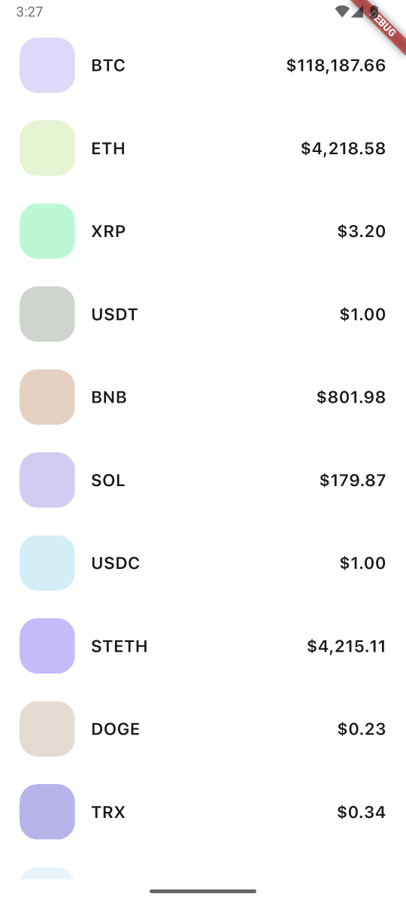

# coincap_testapp

Test application for CoinCap API.



## Generate files

### Injections and `json_serializable`-models:

After adding some new injectable or injecting class need to regenerate file injection.config.dart,
for this do next tasks: update pubspec dependencies and

```sh
flutter packages pub run build_runner build --delete-conflicting-outputs
```

### API keys

Create local file in the root of project with name `.env.json`. Example:

```json`
{
"COINCAP_API_KEY": "api-key"
}
```

Change `api-key` to your CoinCap API key. Add this file to environment variables on building project:

```sh
flutter run --dart-define-from-file=.env.json
```
